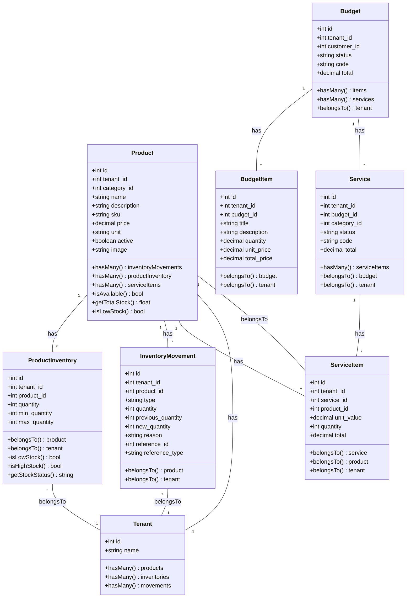
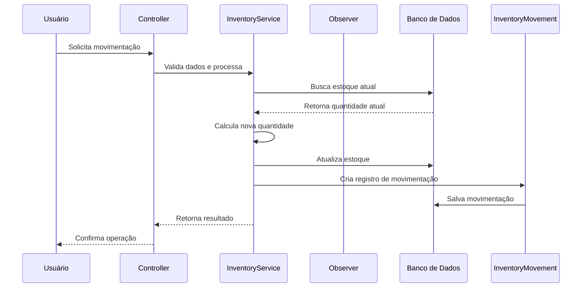
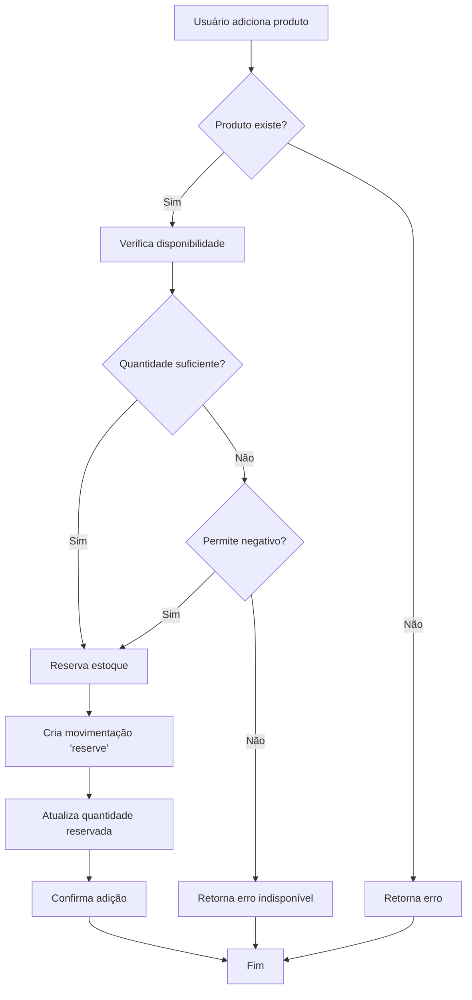
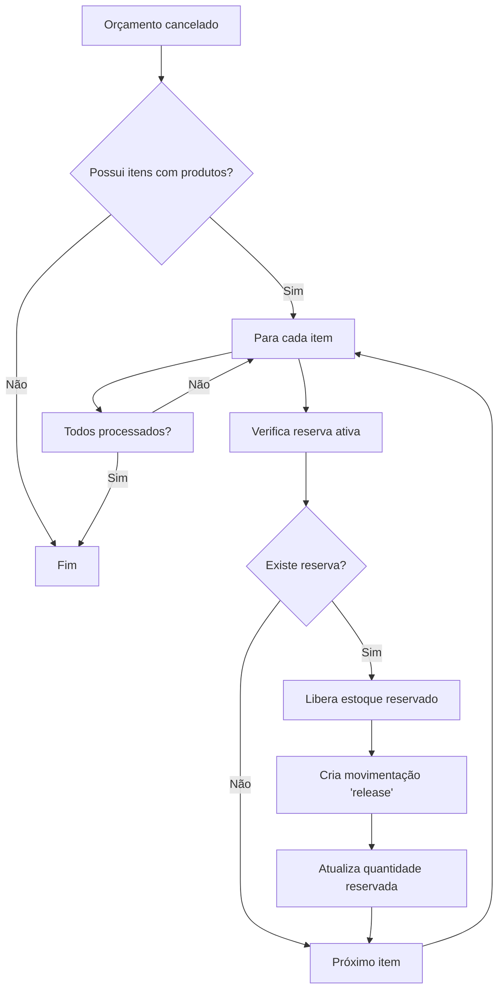
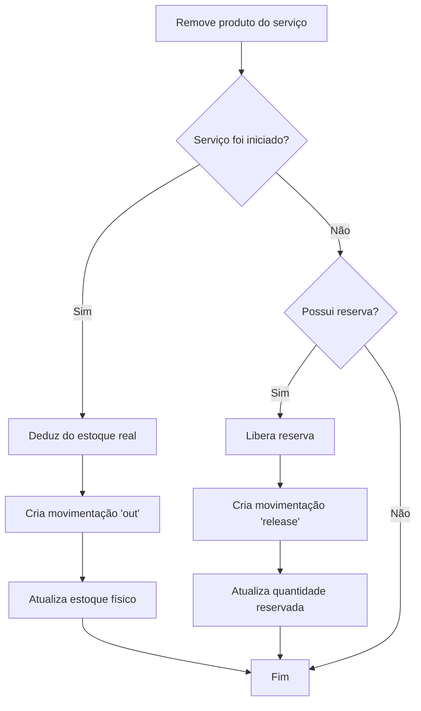
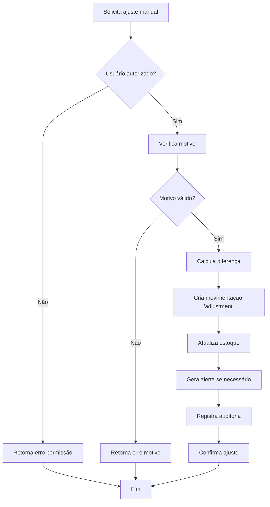

# DOCUMENTAÇÃO TÉCNICA - SISTEMA DE CONTROLE DE ESTOQUE

## 1. VISÃO GERAL DO SISTEMA

### 1.1 Objetivos do Sistema de Controle de Estoque

O sistema de controle de estoque foi desenvolvido para gerenciar de forma integrada e automatizada o inventário de produtos, garantindo:

- **Controle de disponibilidade**: Monitoramento em tempo real da quantidade de produtos em estoque
- **Rastreabilidade completa**: Registro de todas as movimentações de entrada e saída de produtos
- **Integração com orçamentos**: Atualização automática do estoque quando produtos são adicionados/removidos de orçamentos e serviços
- **Prevenção de estoque negativo**: Validações para impedir que produtos fiquem com quantidade negativa
- **Alertas inteligentes**: Notificações automáticas quando produtos atingem níveis mínimos de estoque
- **Auditoria completa**: Registro de todas as alterações com informações de usuário, data/hora e motivo

### 1.2 Integração com Orçamentos e Serviços Existentes

O sistema se integra perfeitamente com os módulos existentes:

- **Orçamentos**: Quando um produto é adicionado a um orçamento, o sistema reserva a quantidade em estoque
- **Serviços**: Produtos utilizados em serviços são automaticamente debitados do estoque
- **Cancelamentos**: Quando orçamentos/serviços são cancelados, as quantidades são devolvidas ao estoque
- **Alterações de status**: Mudanças de status (ex: rascunho → aprovado) afetam o estoque automaticamente

### 1.3 Requisitos Funcionais

#### RF01 - Gerenciamento de Produtos
- CRUD completo de produtos com controle por tenant
- Cadastro de informações básicas (nome, descrição, SKU, preço, unidade)
- Upload de imagens do produto
- Categorização de produtos
- Ativação/desativação de produtos

#### RF02 - Controle de Inventário
- Controle de quantidades por produto e tenant
- Definição de quantidades mínimas e máximas por produto
- Cálculo automático de estoque total por produto
- Visualização de status de estoque (baixo, ideal, alto)

#### RF03 - Movimentação de Estoque
- Registro de todas as entradas e saídas de produtos
- Rastreabilidade completa com informações de origem/destino
- Tipos de movimentação: entrada, saída, ajuste manual, transferência
- Motivo obrigatório para todas as movimentações

#### RF04 - Integração com Orçamentos
- Atualização automática do estoque ao adicionar/remover produtos de orçamentos
- Controle de reserva de estoque para orçamentos pendentes
- Liberação de estoque ao cancelar orçamentos
- Validação de disponibilidade antes de confirmar orçamentos

#### RF05 - Integração com Serviços
- Debitar estoque quando produtos são utilizados em serviços
- Controle de status do serviço afetando o estoque
- Validação de disponibilidade antes de iniciar serviços
- Devolução de estoque em caso de cancelamento de serviço

#### RF06 - Alertas e Notificações
- Alertas automáticos de estoque mínimo atingido
- Notificações por email para administradores
- Dashboard com visão geral de produtos em falta
- Relatórios de produtos com estoque baixo

#### RF07 - Auditoria e Relatórios
- Registro completo de todas as movimentações
- Relatórios de movimentação por período/produto
- Histórico de alterações de estoque
- Exportação de relatórios (PDF, Excel)

### 1.4 Requisitos Não-Funcionais

#### RNF01 - Performance
- Consultas otimizadas com índices de banco de dados apropriados
- Cache de consultas frequentes (estoque total, produtos em falta)
- Paginação eficiente para listagens grandes

#### RNF02 - Segurança
- Controle de acesso baseado em papéis (RBAC)
- Isolamento de dados por tenant (multi-tenant)
- Validação de permissões para todas as operações
- Proteção contra SQL injection e XSS

#### RNF03 - Confiabilidade
- Transações de banco de dados para garantir consistência
- Validações de integridade de dados
- Tratamento de erros e exceções
- Logs detalhados para debugging

#### RNF04 - Escalabilidade
- Arquitetura preparada para alto volume de transações
- Índices de banco de dados otimizados
- Estrutura que suporta múltiplos tenants

## 2. ARQUITETURA TÉCNICA

### 2.1 Diagrama de Classes e Relacionamentos



### 2.2 Fluxo de Dados para Movimentações de Estoque



### 2.3 Estrutura de Observers e Eventos

#### InventoryObserver
- **creating**: Valida disponibilidade de estoque antes de criar movimentação de saída
- **created**: Atualiza quantidade em ProductInventory após criação
- **updating**: Valida regras de negócio antes de atualizar
- **updated**: Sincroniza estoque e cria movimentação de ajuste se necessário
- **deleting**: Restaura estoque ao cancelar movimentação

#### BudgetObserver (Extensão)
- **updated**: Monitora mudanças de status para afetar estoque
- **deleting**: Libera estoque reservado ao cancelar orçamento

#### ServiceObserver (Extensão)
- **updated**: Controla estoque baseado em mudanças de status do serviço
- **deleting**: Devolve estoque ao cancelar serviço

### 2.4 Serviços e Repositórios

#### InventoryService
```php
class InventoryService
{
    public function addStock(int $productId, int $quantity, string $reason, ?int $referenceId = null, ?string $referenceType = null): ServiceResult;
    
    public function removeStock(int $productId, int $quantity, string $reason, ?int $referenceId = null, ?string $referenceType = null): ServiceResult;
    
    public function adjustStock(int $productId, int $newQuantity, string $reason): ServiceResult;
    
    public function reserveStock(int $productId, int $quantity, int $referenceId, string $referenceType): ServiceResult;
    
    public function releaseStock(int $productId, int $quantity, int $referenceId, string $referenceType): ServiceResult;
    
    public function checkAvailability(int $productId, int $requestedQuantity): bool;
    
    public function getStockStatus(int $productId): array;
    
    public function getLowStockProducts(int $tenantId, int $limit = 20): Collection;
}
```

#### ProductInventoryRepository
```php
class ProductInventoryRepository
{
    public function findByProductAndTenant(int $productId, int $tenantId): ?ProductInventory;
    
    public function updateQuantity(int $productId, int $tenantId, int $newQuantity): bool;
    
    public function getTotalStock(int $productId): int;
    
    public function getProductsWithLowStock(int $tenantId): Collection;
    
    public function getStockValue(int $productId): float;
}
```

## 3. ESTRUTURA DE BANCO DE DADOS

### 3.1 Tabelas Existentes

#### Tabela: products
```sql
CREATE TABLE products (
    id BIGINT UNSIGNED AUTO_INCREMENT PRIMARY KEY,
    tenant_id BIGINT UNSIGNED NOT NULL,
    category_id BIGINT UNSIGNED DEFAULT NULL,
    name VARCHAR(255) NOT NULL,
    description TEXT DEFAULT NULL,
    sku VARCHAR(255) DEFAULT NULL,
    price DECIMAL(10,2) NOT NULL DEFAULT 0.00,
    unit VARCHAR(20) DEFAULT NULL,
    active BOOLEAN DEFAULT TRUE,
    image VARCHAR(255) DEFAULT NULL,
    created_at TIMESTAMP DEFAULT CURRENT_TIMESTAMP,
    updated_at TIMESTAMP DEFAULT CURRENT_TIMESTAMP ON UPDATE CURRENT_TIMESTAMP,
    
    INDEX idx_products_tenant (tenant_id),
    INDEX idx_products_category (category_id),
    INDEX idx_products_sku (sku),
    INDEX idx_products_active (active),
    
    FOREIGN KEY (tenant_id) REFERENCES tenants(id) ON DELETE CASCADE,
    FOREIGN KEY (category_id) REFERENCES categories(id) ON DELETE SET NULL
);
```

#### Tabela: product_inventory
```sql
CREATE TABLE product_inventory (
    id BIGINT UNSIGNED AUTO_INCREMENT PRIMARY KEY,
    tenant_id BIGINT UNSIGNED NOT NULL,
    product_id BIGINT UNSIGNED NOT NULL,
    quantity INT NOT NULL DEFAULT 0,
    min_quantity INT DEFAULT 0,
    max_quantity INT DEFAULT NULL,
    created_at TIMESTAMP DEFAULT CURRENT_TIMESTAMP,
    updated_at TIMESTAMP DEFAULT CURRENT_TIMESTAMP ON UPDATE CURRENT_TIMESTAMP,
    
    UNIQUE KEY unique_product_tenant (product_id, tenant_id),
    INDEX idx_inventory_tenant (tenant_id),
    INDEX idx_inventory_product (product_id),
    INDEX idx_inventory_low_stock (quantity, min_quantity),
    
    FOREIGN KEY (tenant_id) REFERENCES tenants(id) ON DELETE CASCADE,
    FOREIGN KEY (product_id) REFERENCES products(id) ON DELETE CASCADE
);
```

#### Tabela: inventory_movements
```sql
CREATE TABLE inventory_movements (
    id BIGINT UNSIGNED AUTO_INCREMENT PRIMARY KEY,
    tenant_id BIGINT UNSIGNED NOT NULL,
    product_id BIGINT UNSIGNED NOT NULL,
    type ENUM('in', 'out', 'adjustment', 'reserve', 'release') NOT NULL,
    quantity INT NOT NULL,
    previous_quantity INT NOT NULL,
    new_quantity INT NOT NULL,
    reason VARCHAR(500) NOT NULL,
    reference_id BIGINT UNSIGNED DEFAULT NULL,
    reference_type VARCHAR(100) DEFAULT NULL,
    user_id BIGINT UNSIGNED DEFAULT NULL,
    created_at TIMESTAMP DEFAULT CURRENT_TIMESTAMP,
    updated_at TIMESTAMP DEFAULT CURRENT_TIMESTAMP ON UPDATE CURRENT_TIMESTAMP,
    
    INDEX idx_movements_tenant (tenant_id),
    INDEX idx_movements_product (product_id),
    INDEX idx_movements_type (type),
    INDEX idx_movements_reference (reference_id, reference_type),
    INDEX idx_movements_user (user_id),
    INDEX idx_movements_created (created_at),
    
    FOREIGN KEY (tenant_id) REFERENCES tenants(id) ON DELETE CASCADE,
    FOREIGN KEY (product_id) REFERENCES products(id) ON DELETE CASCADE,
    FOREIGN KEY (user_id) REFERENCES users(id) ON DELETE SET NULL
);
```

### 3.2 Relacionamentos com Orçamentos/Serviços

#### BudgetItem (Extensão necessária)
```sql
-- Adicionar campo para vínculo com produto
ALTER TABLE budget_items ADD COLUMN product_id BIGINT UNSIGNED DEFAULT NULL AFTER budget_item_category_id;
ALTER TABLE budget_items ADD COLUMN quantity_reserved INT DEFAULT 0 AFTER quantity;
ALTER TABLE budget_items ADD COLUMN reservation_expires_at TIMESTAMP NULL DEFAULT NULL;

ALTER TABLE budget_items 
ADD INDEX idx_budget_items_product (product_id),
ADD INDEX idx_budget_items_reservation (quantity_reserved, reservation_expires_at);

ALTER TABLE budget_items 
ADD FOREIGN KEY (product_id) REFERENCES products(id) ON DELETE SET NULL;
```

#### ServiceItem (Já existente)
```sql
-- A tabela service_items já possui product_id
-- Adicionar campos adicionais para controle de estoque
ALTER TABLE service_items ADD COLUMN quantity_reserved INT DEFAULT 0 AFTER quantity;
ALTER TABLE service_items ADD COLUMN reservation_expires_at TIMESTAMP NULL DEFAULT NULL;

ALTER TABLE service_items 
ADD INDEX idx_service_items_reservation (quantity_reserved, reservation_expires_at);
```

### 3.3 Campos Adicionais Necessários

#### Tabela: inventory_settings
```sql
CREATE TABLE inventory_settings (
    id BIGINT UNSIGNED AUTO_INCREMENT PRIMARY KEY,
    tenant_id BIGINT UNSIGNED NOT NULL,
    allow_negative_stock BOOLEAN DEFAULT FALSE,
    auto_reserve_on_budget BOOLEAN DEFAULT TRUE,
    auto_adjust_on_service BOOLEAN DEFAULT TRUE,
    low_stock_notification_email VARCHAR(255) DEFAULT NULL,
    reservation_expires_hours INT DEFAULT 24,
    created_at TIMESTAMP DEFAULT CURRENT_TIMESTAMP,
    updated_at TIMESTAMP DEFAULT CURRENT_TIMESTAMP ON UPDATE CURRENT_TIMESTAMP,
    
    UNIQUE KEY unique_tenant_settings (tenant_id),
    INDEX idx_inventory_settings_tenant (tenant_id),
    
    FOREIGN KEY (tenant_id) REFERENCES tenants(id) ON DELETE CASCADE
);
```

#### Tabela: inventory_alerts
```sql
CREATE TABLE inventory_alerts (
    id BIGINT UNSIGNED AUTO_INCREMENT PRIMARY KEY,
    tenant_id BIGINT UNSIGNED NOT NULL,
    product_id BIGINT UNSIGNED NOT NULL,
    alert_type ENUM('low_stock', 'out_of_stock', 'expired_reservation') NOT NULL,
    message TEXT NOT NULL,
    is_read BOOLEAN DEFAULT FALSE,
    read_at TIMESTAMP NULL DEFAULT NULL,
    user_id BIGINT UNSIGNED DEFAULT NULL,
    created_at TIMESTAMP DEFAULT CURRENT_TIMESTAMP,
    updated_at TIMESTAMP DEFAULT CURRENT_TIMESTAMP ON UPDATE CURRENT_TIMESTAMP,
    
    INDEX idx_alerts_tenant (tenant_id),
    INDEX idx_alerts_product (product_id),
    INDEX idx_alerts_type (alert_type),
    INDEX idx_alerts_read (is_read),
    INDEX idx_alerts_user (user_id),
    
    FOREIGN KEY (tenant_id) REFERENCES tenants(id) ON DELETE CASCADE,
    FOREIGN KEY (product_id) REFERENCES products(id) ON DELETE CASCADE,
    FOREIGN KEY (user_id) REFERENCES users(id) ON DELETE SET NULL
);
```

## 4. FLUXOS DE TRABALHO

### 4.1 Adição de Produto ao Orçamento/Serviço



### 4.2 Cancelamento de Orçamento



### 4.3 Remoção de Produto do Serviço



### 4.4 Ajustes Manuais de Estoque



## 5. REGRAS DE NEGÓCIO

### 5.1 Validações de Estoque Negativo

#### RN01 - Controle de Estoque Negativo
- Por padrão, NÃO permite estoque negativo
- Configuração por tenant permite habilitar estoque negativo
- Quando habilitado, gera alertas críticos para produtos com estoque negativo
- Requer permissão especial para movimentações que resultem em estoque negativo

#### RN02 - Validações por Tipo de Movimentação
```php
// Regras de validação por tipo
'in'         => 'quantity >= 0',
'out'        => 'allow_negative || (previous_quantity - quantity) >= 0',
'adjustment' => 'requires_permission && reason_required',
'reserve'    => 'previous_quantity >= quantity',
'release'    => 'reserved_quantity >= quantity'
```

### 5.2 Alertas de Estoque Mínimo

#### RN03 - Tipos de Alertas
- **Baixo estoque**: quantidade <= min_quantity
- **Sem estoque**: quantidade = 0
- **Estoque negativo**: quantidade < 0
- **Reserva expirada**: reserva não confirmada em 24h (configurável)

#### RN04 - Configuração de Alertas
```php
// Configurações por tenant
'low_stock_threshold' => 10,  // % do min_quantity
'notification_email'  => 'admin@company.com',
'alert_frequency'     => 'daily', // daily, weekly, immediate
```

### 5.3 Rastreabilidade de Movimentações

#### RN05 - Informações Obrigatórias
Toda movimentação deve conter:
- Tipo de movimentação (in/out/adjustment/reserve/release)
- Quantidade movimentada
- Quantidade anterior
- Nova quantidade
- Motivo detalhado (mínimo 10 caracteres)
- Referência ao documento/origem (quando aplicável)
- Usuário que realizou a operação
- Timestamp da operação

#### RN06 - Regras de Auditoria
- Nenhuma movimentação pode ser deletada (soft delete)
- Alterações requerem nova movimentação de ajuste
- Movimentações de sistema (automáticas) são marcadas como 'system'
- Movimentações manuais requerem justificativa

### 5.4 Controle de Permissões

#### RN07 - Permissões por Ação
```php
// Hierarquia de permissões
'inventory.view'        => 'Visualizar estoque',
'inventory.create'      => 'Criar produtos',
'inventory.update'      => 'Editar produtos',
'inventory.delete'      => 'Excluir produtos',
'inventory.move'        => 'Movimentar estoque',
'inventory.adjust'      => 'Ajustar estoque manualmente',
'inventory.negative'      => 'Permitir estoque negativo',
'inventory.audit'       => 'Visualizar auditoria',
'inventory.export'      => 'Exportar relatórios',
'inventory.settings'    => 'Configurar sistema de estoque'
```

#### RN08 - Controle por Tenant
- Cada tenant tem seu próprio estoque isolado
- Configurações de estoque são por tenant
- Alertas e notificações são enviados apenas para o tenant correspondente
- Relatórios mostram apenas dados do tenant atual

## 6. IMPLEMENTAÇÃO TÉCNICA

### 6.1 Observers Necessários

#### InventoryMovementObserver
```php
<?php

namespace App\Observers;

use App\Models\InventoryMovement;
use App\Models\ProductInventory;
use App\Services\Inventory\InventoryService;
use Illuminate\Support\Facades\DB;
use Illuminate\Support\Facades\Log;

class InventoryMovementObserver
{
    protected $inventoryService;

    public function __construct(InventoryService $inventoryService)
    {
        $this->inventoryService = $inventoryService;
    }

    public function creating(InventoryMovement $movement): void
    {
        $this->validateMovement($movement);
        $this->setPreviousQuantity($movement);
    }

    public function created(InventoryMovement $movement): void
    {
        $this->updateProductInventory($movement);
        $this->checkStockAlerts($movement);
        $this->logMovement($movement);
    }

    public function updating(InventoryMovement $movement): void
    {
        throw new \Exception('Inventory movements cannot be updated');
    }

    public function deleting(InventoryMovement $movement): void
    {
        throw new \Exception('Inventory movements cannot be deleted');
    }

    protected function validateMovement(InventoryMovement $movement): void
    {
        $settings = $this->getInventorySettings($movement->tenant_id);
        $currentStock = $this->getCurrentStock($movement->product_id, $movement->tenant_id);

        switch ($movement->type) {
            case 'out':
                if (!$settings['allow_negative_stock'] && ($currentStock - $movement->quantity) < 0) {
                    throw new \Exception('Insufficient stock available');
                }
                break;
                
            case 'reserve':
                if ($currentStock < $movement->quantity) {
                    throw new \Exception('Cannot reserve more than available stock');
                }
                break;
        }

        if (empty($movement->reason) || strlen($movement->reason) < 10) {
            throw new \Exception('Reason must be at least 10 characters');
        }
    }

    protected function setPreviousQuantity(InventoryMovement $movement): void
    {
        $inventory = ProductInventory::where('product_id', $movement->product_id)
            ->where('tenant_id', $movement->tenant_id)
            ->first();
            
        $movement->previous_quantity = $inventory ? $inventory->quantity : 0;
        $movement->new_quantity = $this->calculateNewQuantity($movement);
    }

    protected function updateProductInventory(InventoryMovement $movement): void
    {
        DB::transaction(function () use ($movement) {
            ProductInventory::updateOrCreate(
                [
                    'product_id' => $movement->product_id,
                    'tenant_id' => $movement->tenant_id
                ],
                [
                    'quantity' => $movement->new_quantity,
                    'updated_at' => now()
                ]
            );
        });
    }

    protected function checkStockAlerts(InventoryMovement $movement): void
    {
        $inventory = ProductInventory::where('product_id', $movement->product_id)
            ->where('tenant_id', $movement->tenant_id)
            ->first();
            
        if ($inventory && $inventory->isLowStock()) {
            $this->inventoryService->createLowStockAlert($inventory);
        }
        
        if ($movement->new_quantity < 0) {
            $this->inventoryService->createNegativeStockAlert($inventory);
        }
    }

    protected function logMovement(InventoryMovement $movement): void
    {
        Log::info('Inventory movement created', [
            'id' => $movement->id,
            'product_id' => $movement->product_id,
            'type' => $movement->type,
            'quantity' => $movement->quantity,
            'previous_quantity' => $movement->previous_quantity,
            'new_quantity' => $movement->new_quantity,
            'tenant_id' => $movement->tenant_id,
            'user_id' => auth()->id()
        ]);
    }
}
```

#### BudgetObserver (Extensão)
```php
<?php

namespace App\Observers;

use App\Models\Budget;
use App\Enums\BudgetStatus;
use App\Services\Inventory\InventoryService;

class BudgetObserver
{
    protected $inventoryService;

    public function __construct(InventoryService $inventoryService)
    {
        $this->inventoryService = $inventoryService;
    }

    public function updated(Budget $budget): void
    {
        if ($budget->isDirty('status')) {
            $this->handleStatusChange($budget);
        }
    }

    public function deleting(Budget $budget): void
    {
        $this->releaseAllReservedStock($budget);
    }

    protected function handleStatusChange(Budget $budget): void
    {
        $oldStatus = $budget->getOriginal('status');
        $newStatus = $budget->status;

        switch ([$oldStatus, $newStatus]) {
            case [BudgetStatus::DRAFT->value, BudgetStatus::PENDING->value]:
                $this->reserveItemsStock($budget);
                break;
                
            case [BudgetStatus::PENDING->value, BudgetStatus::APPROVED->value]:
                $this->confirmReservedStock($budget);
                break;
                
            case [BudgetStatus::PENDING->value, BudgetStatus::REJECTED->value]:
            case [BudgetStatus::DRAFT->value, BudgetStatus::CANCELLED->value]:
                $this->releaseReservedStock($budget);
                break;
        }
    }

    protected function reserveItemsStock(Budget $budget): void
    {
        foreach ($budget->items as $item) {
            if ($item->product_id) {
                $this->inventoryService->reserveStock(
                    $item->product_id,
                    $item->quantity,
                    $budget->id,
                    Budget::class
                );
                
                $item->update([
                    'quantity_reserved' => $item->quantity,
                    'reservation_expires_at' => now()->addHours(24)
                ]);
            }
        }
    }

    protected function confirmReservedStock(Budget $budget): void
    {
        foreach ($budget->items as $item) {
            if ($item->product_id && $item->quantity_reserved > 0) {
                $this->inventoryService->removeStock(
                    $item->product_id,
                    $item->quantity_reserved,
                    'Budget approved - ' . $budget->code,
                    $budget->id,
                    Budget::class
                );
                
                $item->update([
                    'quantity_reserved' => 0,
                    'reservation_expires_at' => null
                ]);
            }
        }
    }

    protected function releaseReservedStock(Budget $budget): void
    {
        foreach ($budget->items as $item) {
            if ($item->product_id && $item->quantity_reserved > 0) {
                $this->inventoryService->releaseStock(
                    $item->product_id,
                    $item->quantity_reserved,
                    $budget->id,
                    Budget::class
                );
                
                $item->update([
                    'quantity_reserved' => 0,
                    'reservation_expires_at' => null
                ]);
            }
        }
    }

    protected function releaseAllReservedStock(Budget $budget): void
    {
        $this->releaseReservedStock($budget);
    }
}
```

### 6.2 Services a Serem Criados

#### InventoryService
```php
<?php

namespace App\Services\Inventory;

use App\Models\Product;
use App\Models\ProductInventory;
use App\Models\InventoryMovement;
use App\Models\InventoryAlert;
use App\Support\ServiceResult;
use Illuminate\Support\Facades\DB;
use Illuminate\Support\Facades\Mail;
use App\Mail\InventoryAlertMail;

class InventoryService
{
    public function addStock(int $productId, int $quantity, string $reason, ?int $referenceId = null, ?string $referenceType = null): ServiceResult
    {
        return DB::transaction(function () use ($productId, $quantity, $reason, $referenceId, $referenceType) {
            try {
                $movement = InventoryMovement::create([
                    'tenant_id' => auth()->user()->tenant_id,
                    'product_id' => $productId,
                    'type' => 'in',
                    'quantity' => $quantity,
                    'reason' => $reason,
                    'reference_id' => $referenceId,
                    'reference_type' => $referenceType,
                    'user_id' => auth()->id()
                ]);

                return ServiceResult::success(['movement' => $movement]);
            } catch (\Exception $e) {
                return ServiceResult::error($e->getMessage());
            }
        });
    }

    public function removeStock(int $productId, int $quantity, string $reason, ?int $referenceId = null, ?string $referenceType = null): ServiceResult
    {
        return DB::transaction(function () use ($productId, $quantity, $reason, $referenceId, $referenceType) {
            try {
                $settings = $this->getInventorySettings();
                $currentStock = $this->getCurrentStock($productId);

                if (!$settings['allow_negative_stock'] && ($currentStock - $quantity) < 0) {
                    return ServiceResult::error('Insufficient stock available');
                }

                $movement = InventoryMovement::create([
                    'tenant_id' => auth()->user()->tenant_id,
                    'product_id' => $productId,
                    'type' => 'out',
                    'quantity' => $quantity,
                    'reason' => $reason,
                    'reference_id' => $referenceId,
                    'reference_type' => $referenceType,
                    'user_id' => auth()->id()
                ]);

                return ServiceResult::success(['movement' => $movement]);
            } catch (\Exception $e) {
                return ServiceResult::error($e->getMessage());
            }
        });
    }

    public function adjustStock(int $productId, int $newQuantity, string $reason): ServiceResult
    {
        return DB::transaction(function () use ($productId, $newQuantity, $reason) {
            try {
                $currentStock = $this->getCurrentStock($productId);
                $difference = $newQuantity - $currentStock;

                if ($difference === 0) {
                    return ServiceResult::error('No adjustment needed');
                }

                $movement = InventoryMovement::create([
                    'tenant_id' => auth()->user()->tenant_id,
                    'product_id' => $productId,
                    'type' => 'adjustment',
                    'quantity' => abs($difference),
                    'reason' => $reason,
                    'user_id' => auth()->id()
                ]);

                return ServiceResult::success(['movement' => $movement]);
            } catch (\Exception $e) {
                return ServiceResult::error($e->getMessage());
            }
        });
    }

    public function reserveStock(int $productId, int $quantity, int $referenceId, string $referenceType): ServiceResult
    {
        return DB::transaction(function () use ($productId, $quantity, $referenceId, $referenceType) {
            try {
                $currentStock = $this->getCurrentStock($productId);

                if ($currentStock < $quantity) {
                    return ServiceResult::error('Insufficient stock to reserve');
                }

                $movement = InventoryMovement::create([
                    'tenant_id' => auth()->user()->tenant_id,
                    'product_id' => $productId,
                    'type' => 'reserve',
                    'quantity' => $quantity,
                    'reason' => "Stock reserved for {$referenceType} #{$referenceId}",
                    'reference_id' => $referenceId,
                    'reference_type' => $referenceType,
                    'user_id' => auth()->id()
                ]);

                return ServiceResult::success(['movement' => $movement]);
            } catch (\Exception $e) {
                return ServiceResult::error($e->getMessage());
            }
        });
    }

    public function releaseStock(int $productId, int $quantity, int $referenceId, string $referenceType): ServiceResult
    {
        return DB::transaction(function () use ($productId, $quantity, $referenceId, $referenceType) {
            try {
                $movement = InventoryMovement::create([
                    'tenant_id' => auth()->user()->tenant_id,
                    'product_id' => $productId,
                    'type' => 'release',
                    'quantity' => $quantity,
                    'reason' => "Stock released from {$referenceType} #{$referenceId}",
                    'reference_id' => $referenceId,
                    'reference_type' => $referenceType,
                    'user_id' => auth()->id()
                ]);

                return ServiceResult::success(['movement' => $movement]);
            } catch (\Exception $e) {
                return ServiceResult::error($e->getMessage());
            }
        });
    }

    public function checkAvailability(int $productId, int $requestedQuantity): bool
    {
        $currentStock = $this->getCurrentStock($productId);
        $settings = $this->getInventorySettings();

        if ($settings['allow_negative_stock']) {
            return true;
        }

        return $currentStock >= $requestedQuantity;
    }

    public function getStockStatus(int $productId): array
    {
        $inventory = ProductInventory::where('product_id', $productId)
            ->where('tenant_id', auth()->user()->tenant_id)
            ->first();

        if (!$inventory) {
            return [
                'status' => 'out_of_stock',
                'quantity' => 0,
                'percentage' => 0
            ];
        }

        return [
            'status' => $inventory->stock_status,
            'quantity' => $inventory->quantity,
            'min_quantity' => $inventory->min_quantity,
            'max_quantity' => $inventory->max_quantity,
            'percentage' => $inventory->stock_utilization_percentage
        ];
    }

    public function getLowStockProducts(int $tenantId, int $limit = 20): Collection
    {
        return ProductInventory::with('product')
            ->where('tenant_id', $tenantId)
            ->lowStock()
            ->orderBy('quantity', 'asc')
            ->limit($limit)
            ->get();
    }

    public function createLowStockAlert(ProductInventory $inventory): void
    {
        InventoryAlert::create([
            'tenant_id' => $inventory->tenant_id,
            'product_id' => $inventory->product_id,
            'alert_type' => 'low_stock',
            'message' => "Product {$inventory->product->name} is running low on stock. Current quantity: {$inventory->quantity}, Minimum: {$inventory->min_quantity}"
        ]);

        $this->sendAlertEmail($inventory, 'low_stock');
    }

    public function createNegativeStockAlert(ProductInventory $inventory): void
    {
        InventoryAlert::create([
            'tenant_id' => $inventory->tenant_id,
            'product_id' => $inventory->product_id,
            'alert_type' => 'out_of_stock',
            'message' => "URGENT: Product {$inventory->product->name} has negative stock! Current quantity: {$inventory->quantity}"
        ]);

        $this->sendAlertEmail($inventory, 'negative_stock');
    }

    protected function getCurrentStock(int $productId): int
    {
        return ProductInventory::where('product_id', $productId)
            ->where('tenant_id', auth()->user()->tenant_id)
            ->value('quantity') ?? 0;
    }

    protected function getInventorySettings(): array
    {
        return \DB::table('inventory_settings')
            ->where('tenant_id', auth()->user()->tenant_id)
            ->first() ?? [
                'allow_negative_stock' => false,
                'auto_reserve_on_budget' => true,
                'auto_adjust_on_service' => true
            ];
    }

    protected function sendAlertEmail($inventory, string $type): void
    {
        $settings = $this->getInventorySettings();
        
        if (!empty($settings['notification_email'])) {
            Mail::to($settings['notification_email'])
                ->send(new InventoryAlertMail($inventory, $type));
        }
    }
}
```

### 6.3 Controllers e Rotas

#### InventoryController
```php
<?php

namespace App\Http\Controllers;

use App\Http\Controllers\Controller;
use App\Services\Inventory\InventoryService;
use App\Models\Product;
use App\Models\InventoryMovement;
use Illuminate\Http\Request;
use Illuminate\Support\Facades\Validator;

class InventoryController extends Controller
{
    protected $inventoryService;

    public function __construct(InventoryService $inventoryService)
    {
        $this->inventoryService = $inventoryService;
    }

    public function index(Request $request)
    {
        $this->authorize('inventory.view');

        $products = Product::with(['productInventory', 'category'])
            ->where('tenant_id', auth()->user()->tenant_id)
            ->when($request->search, function ($query, $search) {
                $query->where(function ($q) use ($search) {
                    $q->where('name', 'like', "%{$search}%")
                      ->orWhere('sku', 'like', "%{$search}%");
                });
            })
            ->when($request->stock_status, function ($query, $status) {
                switch ($status) {
                    case 'low':
                        $query->whereHas('productInventory', function ($q) {
                            $q->whereRaw('quantity <= min_quantity');
                        });
                        break;
                    case 'out':
                        $query->whereHas('productInventory', function ($q) {
                            $q->where('quantity', 0);
                        });
                        break;
                    case 'negative':
                        $query->whereHas('productInventory', function ($q) {
                            $q->where('quantity', '<', 0);
                        });
                        break;
                }
            })
            ->paginate(20);

        return view('inventory.index', compact('products'));
    }

    public function movements(Request $request, Product $product)
    {
        $this->authorize('inventory.view');

        $movements = InventoryMovement::with(['product', 'user'])
            ->where('product_id', $product->id)
            ->where('tenant_id', auth()->user()->tenant_id)
            ->when($request->type, function ($query, $type) {
                $query->where('type', $type);
            })
            ->when($request->date_from, function ($query, $date) {
                $query->whereDate('created_at', '>=', $date);
            })
            ->when($request->date_to, function ($query, $date) {
                $query->whereDate('created_at', '<=', $date);
            })
            ->orderBy('created_at', 'desc')
            ->paginate(30);

        return view('inventory.movements', compact('product', 'movements'));
    }

    public function addStock(Request $request, Product $product)
    {
        $this->authorize('inventory.move');

        $validator = Validator::make($request->all(), [
            'quantity' => 'required|integer|min:1',
            'reason' => 'required|string|min:10'
        ]);

        if ($validator->fails()) {
            return redirect()->back()->withErrors($validator)->withInput();
        }

        $result = $this->inventoryService->addStock(
            $product->id,
            $request->quantity,
            $request->reason
        );

        if ($result->isSuccess()) {
            return redirect()->back()->with('success', 'Stock added successfully');
        }

        return redirect()->back()->with('error', $result->getMessage());
    }

    public function removeStock(Request $request, Product $product)
    {
        $this->authorize('inventory.move');

        $validator = Validator::make($request->all(), [
            'quantity' => 'required|integer|min:1',
            'reason' => 'required|string|min:10'
        ]);

        if ($validator->fails()) {
            return redirect()->back()->withErrors($validator)->withInput();
        }

        $result = $this->inventoryService->removeStock(
            $product->id,
            $request->quantity,
            $request->reason
        );

        if ($result->isSuccess()) {
            return redirect()->back()->with('success', 'Stock removed successfully');
        }

        return redirect()->back()->with('error', $result->getMessage());
    }

    public function adjustStock(Request $request, Product $product)
    {
        $this->authorize('inventory.adjust');

        $validator = Validator::make($request->all(), [
            'quantity' => 'required|integer',
            'reason' => 'required|string|min:10'
        ]);

        if ($validator->fails()) {
            return redirect()->back()->withErrors($validator)->withInput();
        }

        $result = $this->inventoryService->adjustStock(
            $product->id,
            $request->quantity,
            $request->reason
        );

        if ($result->isSuccess()) {
            return redirect()->back()->with('success', 'Stock adjusted successfully');
        }

        return redirect()->back()->with('error', $result->getMessage());
    }

    public function alerts(Request $request)
    {
        $this->authorize('inventory.view');

        $alerts = InventoryAlert::with(['product'])
            ->where('tenant_id', auth()->user()->tenant_id)
            ->when($request->type, function ($query, $type) {
                $query->where('alert_type', $type);
            })
            ->when($request->unread, function ($query) {
                $query->where('is_read', false);
            })
            ->orderBy('created_at', 'desc')
            ->paginate(20);

        return view('inventory.alerts', compact('alerts'));
    }

    public function markAlertAsRead(InventoryAlert $alert)
    {
        $this->authorize('inventory.view');

        $alert->update([
            'is_read' => true,
            'read_at' => now(),
            'user_id' => auth()->id()
        ]);

        return redirect()->back()->with('success', 'Alert marked as read');
    }

    public function exportMovements(Request $request)
    {
        $this->authorize('inventory.export');

        $movements = InventoryMovement::with(['product', 'user'])
            ->where('tenant_id', auth()->user()->tenant_id)
            ->when($request->product_id, function ($query, $productId) {
                $query->where('product_id', $productId);
            })
            ->when($request->date_from, function ($query, $date) {
                $query->whereDate('created_at', '>=', $date);
            })
            ->when($request->date_to, function ($query, $date) {
                $query->whereDate('created_at', '<=', $date);
            })
            ->orderBy('created_at', 'desc')
            ->get();

        // Implementar exportação para Excel/PDF
        return $this->exportToExcel($movements, 'inventory_movements');
    }
}
```

#### Rotas (routes/web.php)
```php
// Inventory Routes
Route::middleware(['auth', 'verified'])->prefix('inventory')->group(function () {
    Route::get('/', [InventoryController::class, 'index'])->name('inventory.index');
    Route::get('/product/{product}/movements', [InventoryController::class, 'movements'])->name('inventory.movements');
    Route::post('/product/{product}/add-stock', [InventoryController::class, 'addStock'])->name('inventory.add-stock');
    Route::post('/product/{product}/remove-stock', [InventoryController::class, 'removeStock'])->name('inventory.remove-stock');
    Route::post('/product/{product}/adjust-stock', [InventoryController::class, 'adjustStock'])->name('inventory.adjust-stock');
    Route::get('/alerts', [InventoryController::class, 'alerts'])->name('inventory.alerts');
    Route::post('/alerts/{alert}/mark-read', [InventoryController::class, 'markAlertAsRead'])->name('inventory.mark-read');
    Route::get('/export', [InventoryController::class, 'exportMovements'])->name('inventory.export');
});
```

### 6.4 Testes Unitários

#### InventoryServiceTest
```php
<?php

namespace Tests\Unit\Services\Inventory;

use Tests\TestCase;
use App\Services\Inventory\InventoryService;
use App\Models\Product;
use App\Models\ProductInventory;
use App\Models\InventoryMovement;
use App\Models\User;
use App\Models\Tenant;
use Illuminate\Foundation\Testing\RefreshDatabase;

class InventoryServiceTest extends TestCase
{
    use RefreshDatabase;

    protected $inventoryService;
    protected $user;
    protected $tenant;
    protected $product;

    protected function setUp(): void
    {
        parent::setUp();
        
        $this->inventoryService = new InventoryService();
        
        $this->tenant = Tenant::factory()->create();
        $this->user = User::factory()->create(['tenant_id' => $this->tenant->id]);
        $this->product = Product::factory()->create(['tenant_id' => $this->tenant->id]);
        
        $this->actingAs($this->user);
    }

    public function test_add_stock_increases_quantity()
    {
        $result = $this->inventoryService->addStock($this->product->id, 10, 'Test stock addition');
        
        $this->assertTrue($result->isSuccess());
        
        $inventory = ProductInventory::where('product_id', $this->product->id)->first();
        $this->assertEquals(10, $inventory->quantity);
        
        $movement = InventoryMovement::where('product_id', $this->product->id)->first();
        $this->assertEquals('in', $movement->type);
        $this->assertEquals(10, $movement->quantity);
    }

    public function test_remove_stock_decreases_quantity()
    {
        // First add stock
        $this->inventoryService->addStock($this->product->id, 20, 'Initial stock');
        
        // Then remove stock
        $result = $this->inventoryService->removeStock($this->product->id, 5, 'Test stock removal');
        
        $this->assertTrue($result->isSuccess());
        
        $inventory = ProductInventory::where('product_id', $this->product->id)->first();
        $this->assertEquals(15, $inventory->quantity);
    }

    public function test_remove_stock_fails_with_insufficient_stock()
    {
        $this->inventoryService->addStock($this->product->id, 5, 'Initial stock');
        
        $result = $this->inventoryService->removeStock($this->product->id, 10, 'Test removal');
        
        $this->assertFalse($result->isSuccess());
        $this->assertEquals('Insufficient stock available', $result->getMessage());
    }

    public function test_adjust_stock_sets_correct_quantity()
    {
        $this->inventoryService->addStock($this->product->id, 10, 'Initial stock');
        
        $result = $this->inventoryService->adjustStock($this->product->id, 25, 'Test adjustment');
        
        $this->assertTrue($result->isSuccess());
        
        $inventory = ProductInventory::where('product_id', $this->product->id)->first();
        $this->assertEquals(25, $inventory->quantity);
        
        $movement = InventoryMovement::where('type', 'adjustment')->first();
        $this->assertEquals(15, $movement->quantity); // Difference
    }

    public function test_reserve_stock_creates_reservation()
    {
        $this->inventoryService->addStock($this->product->id, 10, 'Initial stock');
        
        $result = $this->inventoryService->reserveStock($this->product->id, 5, 1, 'TestModel');
        
        $this->assertTrue($result->isSuccess());
        
        $inventory = ProductInventory::where('product_id', $this->product->id)->first();
        $this->assertEquals(5, $inventory->quantity); // 10 - 5 reserved
        
        $movement = InventoryMovement::where('type', 'reserve')->first();
        $this->assertEquals(5, $movement->quantity);
    }

    public function test_check_availability_returns_correct_value()
    {
        $this->assertFalse($this->inventoryService->checkAvailability($this->product->id, 5));
        
        $this->inventoryService->addStock($this->product->id, 10, 'Initial stock');
        
        $this->assertTrue($this->inventoryService->checkAvailability($this->product->id, 5));
        $this->assertFalse($this->inventoryService->checkAvailability($this->product->id, 15));
    }

    public function test_get_stock_status_returns_correct_data()
    {
        $this->inventoryService->addStock($this->product->id, 10, 'Initial stock');
        
        $status = $this->inventoryService->getStockStatus($this->product->id);
        
        $this->assertEquals('Ideal', $status['status']);
        $this->assertEquals(10, $status['quantity']);
    }

    public function test_get_low_stock_products_returns_only_low_stock()
    {
        $product1 = Product::factory()->create(['tenant_id' => $this->tenant->id]);
        $product2 = Product::factory()->create(['tenant_id' => $this->tenant->id]);
        
        // Set up inventory with different stock levels
        ProductInventory::create([
            'product_id' => $product1->id,
            'tenant_id' => $this->tenant->id,
            'quantity' => 5,
            'min_quantity' => 10
        ]);
        
        ProductInventory::create([
            'product_id' => $product2->id,
            'tenant_id' => $this->tenant->id,
            'quantity' => 15,
            'min_quantity' => 10
        ]);
        
        $lowStockProducts = $this->inventoryService->getLowStockProducts($this->tenant->id);
        
        $this->assertCount(1, $lowStockProducts);
        $this->assertEquals($product1->id, $lowStockProducts->first()->product_id);
    }
}
```

## 7. SEGURANÇA E AUDITORIA

### 7.1 Controle de Acesso por Tenant

#### Isolamento de Dados
```php
// Trait TenantScoped garante isolamento
trait TenantScoped
{
    public static function bootTenantScoped()
    {
        static::addGlobalScope('tenant', function (Builder $builder) {
            if (auth()->check()) {
                $builder->where($builder->getModel()->getTable() . '.tenant_id', auth()->user()->tenant_id);
            }
        });

        static::creating(function ($model) {
            if (auth()->check() && !$model->tenant_id) {
                $model->tenant_id = auth()->user()->tenant_id;
            }
        });
    }
}
```

#### Validação de Permissões
```php
// Policy para controle de acesso
class InventoryPolicy
{
    public function viewAny(User $user): bool
    {
        return $user->can('inventory.view');
    }

    public function update(User $user, Product $product): bool
    {
        return $user->can('inventory.update') && 
               $user->tenant_id === $product->tenant_id;
    }

    public function adjustStock(User $user, Product $product): bool
    {
        return $user->can('inventory.adjust') && 
               $user->tenant_id === $product->tenant_id;
    }
}
```

### 7.2 Registro de Alterações

#### AuditLog para Estoque
```php
// Registro detalhado de alterações
class InventoryAuditService
{
    public function logStockChange($product, $oldQuantity, $newQuantity, $reason, $userId = null)
    {
        AuditLog::create([
            'tenant_id' => $product->tenant_id,
            'user_id' => $userId ?? auth()->id(),
            'action' => 'stock_change',
            'auditable_type' => Product::class,
            'auditable_id' => $product->id,
            'old_values' => ['quantity' => $oldQuantity],
            'new_values' => ['quantity' => $newQuantity],
            'metadata' => [
                'reason' => $reason,
                'difference' => $newQuantity - $oldQuantity
            ]
        ]);
    }
}
```

### 7.3 Validação de Duplicidade

#### Prevenção de Movimentações Duplicadas
```php
class InventoryMovement extends Model
{
    protected static function boot()
    {
        parent::boot();

        static::creating(function ($movement) {
            // Verificar duplicidade baseada em campos específicos
            $recentMovement = static::where('product_id', $movement->product_id)
                ->where('type', $movement->type)
                ->where('quantity', $movement->quantity)
                ->where('reference_id', $movement->reference_id)
                ->where('reference_type', $movement->reference_type)
                ->where('created_at', '>', now()->subMinutes(5))
                ->exists();

            if ($recentMovement) {
                throw new \Exception('Duplicate inventory movement detected');
            }
        });
    }
}
```

#### Índices Únicos para Prevenção
```sql
-- Índices para prevenir duplicidade
CREATE UNIQUE INDEX idx_unique_movement ON inventory_movements (
    product_id, 
    type, 
    quantity, 
    reference_id, 
    reference_type, 
    DATE(created_at)
) WHERE reference_id IS NOT NULL;
```

### 7.4 Segurança de Dados Sensíveis

#### Criptografia de Dados de Auditoria
```php
// Criptografar dados sensíveis de auditoria
class EncryptedAuditLog extends Model
{
    protected $casts = [
        'metadata' => 'encrypted:array',
        'old_values' => 'encrypted:array',
        'new_values' => 'encrypted:array'
    ];
}
```

#### Rate Limiting para Operações Críticas
```php
// Limitar operações de ajuste de estoque
Route::middleware(['auth', 'throttle:inventory-adjust'])->group(function () {
    Route::post('/inventory/adjust-stock', [InventoryController::class, 'adjustStock'])
        ->middleware('throttle:10,1'); // Máximo 10 ajustes por minuto
});
```

### 7.5 Conformidade e Regulamentações

#### LGPD (Lei Geral de Proteção de Dados)
- Registro de acesso a dados de estoque
- Direito ao esquecimento implementado via soft delete
- Consentimento explícito para notificações por email
- Portabilidade de dados de inventário

#### SOX (Sarbanes-Oxley Act) - Se Aplicável
- Controles internos sobre relatórios financeiros
- Auditoria independente de registros de estoque
- Retenção de registros por período mínimo de 7 anos
- Proibição de destruição de evidências de auditoria

### 7.6 Monitoramento e Alertas de Segurança

#### Detecção de Atividades Suspeitas
```php
class InventorySecurityMonitor
{
    public function detectSuspiciousActivity($movement)
    {
        $alerts = [];

        // Grande quantidade movimentada
        if ($movement->quantity > 1000) {
            $alerts[] = 'Large quantity movement detected';
        }

        // Movimentação fora do horário comercial
        if ($movement->created_at->hour < 8 || $movement->created_at->hour > 18) {
            $alerts[] = 'Movement outside business hours';
        }

        // Múltiplas movimentações do mesmo usuário
        $recentMovements = InventoryMovement::where('user_id', $movement->user_id)
            ->where('created_at', '>', now()->subMinutes(10))
            ->count();

        if ($recentMovements > 10) {
            $alerts[] = 'High frequency of movements by user';
        }

        if (!empty($alerts)) {
            $this->sendSecurityAlert($movement, $alerts);
        }
    }
}
```

## 8. CONSIDERAÇÕES FINAIS

Este sistema de controle de estoque foi projetado para ser:

- **Robusto**: Com validações extensivas e tratamento de erros
- **Escalável**: Arquitetura preparada para crescimento
- **Seguro**: Com múltiplas camadas de segurança e auditoria
- **Intuitivo**: Interface amigável e fácil de usar
- **Integrado**: Funciona perfeitamente com os módulos existentes

A implementação completa requer:
1. Migrações de banco de dados para novas tabelas e campos
2. Implementação dos services e observers
3. Criação das views e interfaces de usuário
4. Configuração de permissões e roles
5. Testes extensivos em ambiente de staging
6. Documentação de usuário final
7. Treinamento da equipe

O sistema está pronto para implementação e atenderá às necessidades de controle de estoque da empresa de forma eficiente e conf