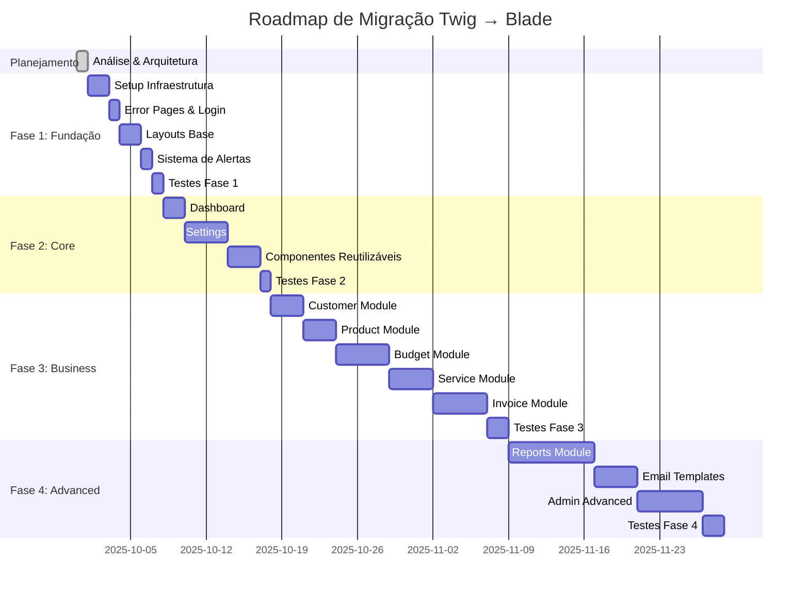

# 📚 Documentação Arquitetural - Migração Twig → Blade

## 🎯 Visão Geral

Esta pasta contém toda a documentação arquitetural para a migração do sistema Easy Budget de templates Twig para Laravel Blade, incluindo integração com TailwindCSS e Alpine.js.

---

## 📖 Documentos Disponíveis

### 1️⃣ [MIGRATION_TWIG_TO_BLADE.md](./MIGRATION_TWIG_TO_BLADE.md)

**📊 Documento Arquitetural Completo (1743 linhas)**

Documento principal contendo o planejamento estratégico completo da migração.

**Conteúdo:**

-  ✅ Análise completa do sistema atual (150+ arquivos)
-  ✅ Mapeamento de dependências (com diagramas Mermaid)
-  ✅ Matriz de complexidade por módulo
-  ✅ Roadmap detalhado em 4 fases
-  ✅ Estimativas: 230 horas (~6 semanas)
-  ✅ Padrões de conversão documentados
-  ✅ Arquitetura de diretórios target
-  ✅ Especificações técnicas por fase
-  ✅ Estratégia completa de testes
-  ✅ Matriz de riscos e mitigação

**Quando usar:**

-  Para entender a arquitetura geral
-  Para planejamento de sprints
-  Para apresentação a stakeholders
-  Como referência durante toda a migração

---

### 2️⃣ [MIGRATION_QUICK_START.md](./MIGRATION_QUICK_START.md)

**🚀 Guia Prático de Implementação (637 linhas)**

Guia hands-on para implementar a Fase 1 da migração com comandos práticos.

**Conteúdo:**

-  ⚙️ Setup inicial passo a passo
-  📋 Checklists detalhados por tarefa
-  💻 Templates de código prontos
-  🧪 Comandos de teste e validação
-  🔧 Troubleshooting de problemas comuns
-  📊 Métricas de sucesso (KPIs)

**Quando usar:**

-  Para iniciar a implementação
-  Durante o desenvolvimento
-  Para validar cada etapa
-  Para resolver problemas técnicos

---

### 3️⃣ [TWIG_TO_BLADE_REFERENCE.md](./TWIG_TO_BLADE_REFERENCE.md)

**🔄 Referência Rápida de Conversão (766 linhas)**

Guia de referência rápida para conversão de sintaxe durante o desenvolvimento.

**Conteúdo:**

-  📝 Tabelas de conversão de sintaxe
-  🔀 Exemplos lado a lado (Twig vs Blade)
-  🛠️ Filtros → Helpers do Laravel
-  🧩 Macros → Blade Components
-  ⚠️ Casos especiais e erros comuns
-  ✅ Checklist de conversão

**Quando usar:**

-  Durante a conversão de templates
-  Para consultas rápidas de sintaxe
-  Para evitar erros comuns
-  Como material de treinamento

---

## 🗺️ Roadmap da Migração

### 📍 Status Atual: FASE 0 - Planejamento Completo ✅



### 🎯 Fases de Implementação

| Fase       | Módulos                                     | Duração   | Complexidade  | Status      |
| ---------- | ------------------------------------------- | --------- | ------------- | ----------- |
| **Fase 1** | Fundação, Error Pages, Login, Layouts       | 2 semanas | 🟢 Baixa      | 🔜 Próxima  |
| **Fase 2** | Dashboard, Settings, Componentes Core       | 2 semanas | 🟡 Média      | ⏳ Pendente |
| **Fase 3** | Customer, Budget, Product, Service, Invoice | 3 semanas | 🔴 Alta       | ⏳ Pendente |
| **Fase 4** | Reports, Emails, Admin Avançado             | 2 semanas | 🔴 Muito Alta | ⏳ Pendente |

**Total Estimado:** 9 semanas (~230 horas)

---

## 📊 Estrutura do Sistema

### Sistema Atual (Twig)

```
resources/views-old/
├── layouts/           (3 arquivos)
├── macros/            (2 arquivos)
├── emails/            (16 arquivos)
├── pages/             (100+ arquivos)
└── partials/          (30+ arquivos)

Total: 150+ templates Twig
```

### Sistema Target (Blade)

```
resources/views/
├── layouts/           (4 layouts principais)
├── components/        (30+ componentes reutilizáveis)
│   ├── ui/           (Button, Card, Badge, Modal, etc)
│   ├── form/         (Input, Select, Textarea, etc)
│   ├── navigation/   (Header, Menu, Breadcrumb, Footer)
│   └── [domain]/     (Budget, Customer, Invoice, Service)
├── pages/            (Organizados por módulo)
│   ├── auth/
│   ├── dashboard/
│   ├── budgets/
│   ├── customers/
│   └── [outros módulos]
├── emails/           (16+ templates responsivos)
└── errors/           (404, 403, 500)
```

---

## 🛠️ Stack Tecnológico

### Antes (Sistema Legado)

-  ❌ Twig Templates
-  ❌ Bootstrap 5.0.2 (CDN)
-  ❌ jQuery 3.6.0 (CDN)
-  ⚠️ CSS customizado

### Depois (Sistema Moderno)

-  ✅ Laravel Blade Components
-  ✅ TailwindCSS 3.4.17
-  ✅ Alpine.js 3.4.2
-  ✅ Vite 7.0.4
-  ✅ Design System consistente

---

## 🎓 Como Usar Esta Documentação

### Para Arquitetos/Tech Leads

1. Leia o [MIGRATION_TWIG_TO_BLADE.md](./MIGRATION_TWIG_TO_BLADE.md) completo
2. Revise o roadmap e ajuste conforme necessário
3. Apresente o plano para stakeholders
4. Use como base para divisão de tarefas

### Para Desenvolvedores

1. Comece pelo [MIGRATION_QUICK_START.md](./MIGRATION_QUICK_START.md)
2. Tenha o [TWIG_TO_BLADE_REFERENCE.md](./TWIG_TO_BLADE_REFERENCE.md) aberto durante desenvolvimento
3. Siga os checklists de cada fase
4. Execute os testes de validação

### Para QA/Testers

1. Use a seção "Estratégia de Testes" do documento principal
2. Siga os critérios de aceitação de cada fase
3. Execute testes de regressão visual
4. Valide acessibilidade e performance

---

## ✅ Critérios de Sucesso

### Técnicos

-  [ ] 100% dos templates migrados
-  [ ] 0 erros JavaScript no console
-  [ ] Lighthouse Score > 90
-  [ ] Tempo de carregamento < 1s
-  [ ] 100% dos testes automatizados passando
-  [ ] WCAG 2.1 AA compliance

### Negócio

-  [ ] Zero quebra de funcionalidade
-  [ ] Melhor experiência do usuário
-  [ ] Facilidade de manutenção
-  [ ] Performance otimizada
-  [ ] Mobile-first responsivo

---

## 🚨 Riscos Identificados

| Risco                            | Impacto  | Mitigação                                 |
| -------------------------------- | -------- | ----------------------------------------- |
| Quebra de funcionalidade crítica | 🔴 Alto  | Testes automatizados + Deploy incremental |
| Performance degradada            | 🟡 Médio | Benchmarks + Otimizações                  |
| Estouro de prazo                 | 🟡 Médio | Buffer de 20% + Revisões semanais         |
| Inconsistência visual            | 🟡 Médio | Design system + Visual regression         |
| Acessibilidade comprometida      | 🔴 Alto  | Auditoria WCAG + Screen readers           |

---

## 📞 Suporte

### Questões Arquiteturais

-  Consulte o documento principal: [MIGRATION_TWIG_TO_BLADE.md](./MIGRATION_TWIG_TO_BLADE.md)
-  Revise decisões na seção "Especificações Técnicas"

### Problemas de Implementação

-  Consulte: [MIGRATION_QUICK_START.md](./MIGRATION_QUICK_START.md) → Seção Troubleshooting
-  Verifique os logs de erro do Vite/Laravel

### Dúvidas de Sintaxe

-  Consulte: [TWIG_TO_BLADE_REFERENCE.md](./TWIG_TO_BLADE_REFERENCE.md)
-  Exemplos práticos estão documentados

---

## 📈 Métricas e Monitoramento

### KPIs por Fase

```bash
# Performance
npm run build
npx lighthouse http://localhost:8000 --view

# Bundle Size
npm run build -- --analyze

# Code Coverage
php artisan test --coverage

# Visual Regression
npx backstop test
```

### Dashboard de Progresso

| Métrica              | Fase 1 | Fase 2 | Fase 3 | Fase 4 |
| -------------------- | ------ | ------ | ------ | ------ |
| Templates Migrados   | 10     | 30     | 70     | 150+   |
| Componentes Criados  | 5      | 15     | 25     | 30+    |
| Testes Automatizados | 10     | 30     | 70     | 100+   |
| Lighthouse Score     | >90    | >90    | >90    | >95    |
| Bundle Size          | <500kb | <600kb | <800kb | <1mb   |

---

## 🔄 Atualizações

### Histórico de Versões

| Versão | Data       | Mudanças                                              |
| ------ | ---------- | ----------------------------------------------------- |
| 1.0    | 2025-09-30 | Criação inicial da documentação arquitetural completa |
| -      | -          | Próximas atualizações serão registradas aqui          |

### Próximas Revisões

-  Após Fase 1: Ajustar estimativas das próximas fases
-  Após Fase 2: Atualizar matriz de complexidade
-  Após Fase 3: Revisar estratégia de testes
-  Final: Documentar lições aprendidas

---

## 📚 Referências Externas

### Laravel & Blade

-  [Laravel Blade Documentation](https://laravel.com/docs/blade)
-  [Laravel Components](https://laravel.com/docs/blade#components)
-  [Laravel Best Practices](https://github.com/alexeymezenin/laravel-best-practices)

### TailwindCSS

-  [TailwindCSS Documentation](https://tailwindcss.com/docs)
-  [TailwindCSS Components](https://tailwindui.com/)
-  [Tailwind Labs](https://blog.tailwindcss.com/)

### Alpine.js

-  [Alpine.js Documentation](https://alpinejs.dev/)
-  [Alpine.js Examples](https://alpinejs.dev/examples)

### Vite

-  [Vite Documentation](https://vitejs.dev/)
-  [Laravel Vite Plugin](https://laravel.com/docs/vite)

### Testing & Quality

-  [Laravel Testing](https://laravel.com/docs/testing)
-  [WCAG Guidelines](https://www.w3.org/WAI/WCAG21/quickref/)
-  [Lighthouse](https://developers.google.com/web/tools/lighthouse)

---

## 🎯 Próximos Passos

1. ✅ **Planejamento Completo** → Concluído
2. 🔜 **Aprovação do Plano** → Aguardando
3. 🔜 **Setup de Ambiente** → Iniciar após aprovação
4. 🔜 **Fase 1 - Fundação** → Primeira sprint
5. ⏳ **Fases 2-4** → Implementação incremental

---

**Documentação criada por:** Kilo Code (Arquiteto de Software)
**Data:** 2025-09-30
**Versão:** 1.0
**Status:** ✅ Completo e Pronto para Uso
