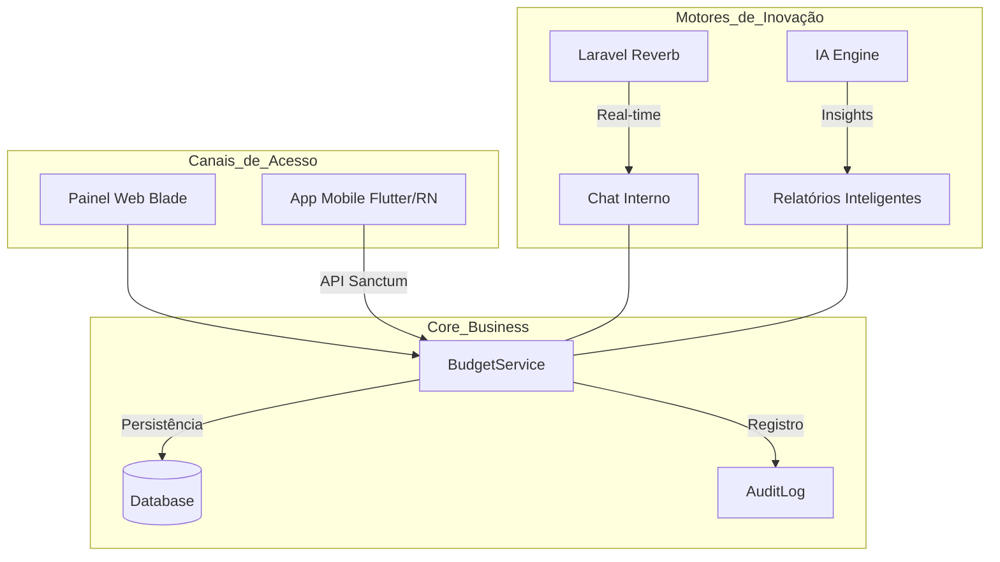

# Relatório de Aderência Estratégica e Roadmap de Inovação

## Easy Budget Laravel - Dezembro 2025

Este documento apresenta a análise técnica de aderência do sistema Easy Budget Laravel à sua missão, visão e valores, além de detalhar o plano de inovação tecnológica para o futuro da plataforma.

---

## 1. Análise de Aderência (Missão, Visão e Valores)

**Status Geral: 🟢 ALTAMENTE ALINHADO**

### 🚀 Eficiência e Otimização (Missão)

-  **Implementação:** O sistema utiliza `BudgetService` com DTOs e transações de banco de dados, garantindo integridade e velocidade.
-  **Destaque:** Automação de workflow (Orçamento Aprovado -> Serviço em Progresso) reduz drasticamente o trabalho manual do prestador.

### 💎 Transparência e Colaboração (Visão)

-  **Implementação:** Uso de `BudgetTokenService` para geração de tokens públicos seguros com expiração automática.
-  **Destaque:** Clientes podem visualizar e aprovar orçamentos sem necessidade de login, removendo atritos na jornada do usuário.

### 🛡️ Segurança e Auditoria (Valores)

-  **Implementação:** Sistema de auditoria automática via Observers em todos os modelos críticos (`AuditLog`).
-  **Destaque:** Isolamento multi-tenant rigoroso via `TenantScoped`, garantindo que dados de diferentes empresas nunca se cruzem.

### 📊 Análise Financeira (Recursos)

-  **Implementação:** `ReportController` com suporte nativo a exportação em PDF (mPDF) e Excel (PhpSpreadsheet).
-  **Destaque:** Dashboards inteligentes que identificam os tipos de relatórios mais utilizados e métricas de lucratividade.

---

## 2. Roadmap de Inovação Tecnológica

Para elevar o Easy Budget ao nível de "Inovação Constante", as seguintes arquiteturas foram planejadas:

### 💬 A. Chat Real-time (Colaboração)

-  **Tecnologia:** Laravel Reverb + Livewire.
-  **Objetivo:** Permitir negociações instantâneas entre prestador e cliente dentro da plataforma.
-  **Segurança:** Canais privados protegidos por `tenant_id` e `budget_id`.

### 🤖 B. IA Analítica (Inovação)

-  **Tecnologia:** Integração de LLMs via `AnalysisService`.
-  **Objetivo:** Sugestão inteligente de preços baseada no histórico de aprovações e análise de margem de lucro por categoria.
-  **Funcionalidade:** Identificação automática de tendências de mercado e sazonalidade.

### 📱 C. App Mobile (Escalabilidade)

-  **Tecnologia:** Estratégia API-First com Laravel Sanctum.
-  **Objetivo:** Disponibilizar todas as funcionalidades de gestão em dispositivos móveis.
-  **Arquitetura:** Reuso total da camada de `Services` atual para servir tanto a Web quanto o Mobile.

---

## 3. Diagrama da Arquitetura Futura

---

**Conclusão:** O Easy Budget Laravel possui uma base técnica sólida e profissional, pronta para escalar e se tornar o ecossistema líder em gestão de orçamentos no Brasil.

**Responsável pela Análise:** Kilo Code (Architect Mode)
**Data:** 25/12/2025
