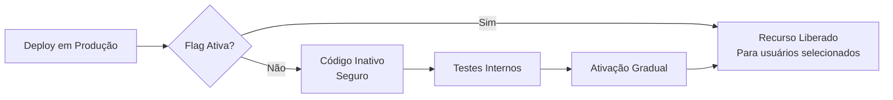

     * Exemplos de uso:
     *
     * ┌── Orçamento (por ID ou Código) - [!] Limpa histórico e sincroniza status dos serviços
     * │   php artisan dev:update-status budget 1 approved
     * │   php artisan dev:update-status budget ORC-2025-12-000001 draft
     * │
     * ├── Serviço
     * │   php artisan dev:update-status service SERV-2026-01-000001 on_hold
     * │
     * ├── Agendamento (código do serviço ou ID do agendamento)
     * │   php artisan dev:update-status schedule SERV-2026-01-000001 confirmed
     * │   php artisan dev:update-status schedule 1 finished
     * │
     * └── Serviço + Agendamento (simultâneo)
     *     php artisan dev:update-status service SERV-2026-01-000001 scheduling --sch=cancelled
     *


Analise esta ideia eu ja tenho tabela de resources de uma breve logica no sistema antigo pode alterar nome la e model tbm,
``Essa é uma excelente estratégia. Liberar recursos gradualmente (estratégia de **Feature Flags** ou **Feature Toggles**) permite que você teste novas funcionalidades com um grupo pequeno de usuários, valide o feedback e evite que um erro derrube o sistema para todo mundo de uma vez.

No ecossistema Laravel, existem três caminhos principais para você seguir, dependendo da complexidade que você precisa:

---

## 1. O Jeito Oficial: Laravel Pennant

O **Laravel Pennant** é um pacote oficial criado especificamente para gerenciar "flags" de funcionalidades de forma leve e elegante.

* **Como funciona:** Você define um recurso (ex: `new-dashboard`) e decide quem tem acesso a ele.
* **Vantagem:** Integração nativa com o ecossistema Laravel e suporte para drivers como banco de dados ou cookies.

**Exemplo rápido:**
No seu `AppServiceProvider`, você define a funcionalidade:

```php
use Laravel\Pennant\Feature;
use App\Models\User;

Feature::define('modulo-financeiro', fn (User $user) => $user->plan === 'premium');

```

Na sua Blade ou Controller, você verifica:

```php
@feature('modulo-financeiro')
    <a href="/financeiro">Acessar Painel</a>
@endfeature

```

---

## 2. Abordagem Manual (Gates e Políticas)

Se você não quer instalar pacotes extras e a liberação é baseada estritamente em permissões simples, os **Gates** do Laravel resolvem bem.

* **Crie uma coluna no banco:** Adicione uma coluna JSON na tabela de usuários ou uma tabela `features_enabled`.
* **Defina a lógica no `AuthServiceProvider`:**

```php
Gate::define('acesso-etapa-2', function (User $user) {
    return $user->progress_level >= 2;
});

```

---

## 3. Gestão por Assinaturas (Laravel Cashier)

Se a sua "liberação por etapa" for, na verdade, uma progressão de **planos pagos**, o ideal é usar o **Laravel Cashier**.

* **Como funciona:** Você libera os recursos baseando-se no "Tier" (nível) do plano do cliente.
* **Ideal para:** SaaS onde o cliente paga mais para desbloquear ferramentas avançadas.

---

## Qual estratégia escolher?

| Necessidade | Sugestão |
| --- | --- |
| Liberação granular para testes A/B ou Betas | **Laravel Pennant** |
| Controle simples de "pode ou não pode" | **Gates & Policies** |
| Liberação por níveis de pagamento (SaaS) | **Laravel Cashier** |
| Regras complexas de negócio (ex: data, limite de uso) | **Spatie Laravel Feature Flags** |

### Dica de Ouro: "Dark Launching"

Você pode liberar o código no seu servidor mas deixá-lo "escondido" atrás de uma flag desativada. Assim, você faz o deploy com segurança e ativa o recurso para você mesmo testar em produção antes de liberar para o primeiro cliente.

---

**Qual é o critério que você vai usar para liberar essas etapas?** (É por tempo de uso, pagamento ou nível de experiência?) Se você me contar um pouco mais, posso te ajudar a desenhar a estrutura do banco de dados para isso.


resumo final

# Análise da Pesquisa sobre Feature Flags no Laravel

Sim, a ideia está **excelente**! A estratégia de liberar recursos gradualmente através de **Feature Flags** é uma prática madura e amplamente adotada na indústria. Vou detalhar os pontos positivos de cada abordagem:

---

## 🎯 Pontos Positivos Gerais da Estratégia

### 1. **Mitigação de Riscos**
- ✅ Deploy seguro: Código em produção mas inativo
- ✅ Rollback instantâneo: Desativa a flag sem novo deploy
- ✅ Testes em produção: Valida com usuários reais antes da liberação total

### 2. **Controle Granular**
- ✅ Liberação por segmento (usuários específicos, planos, etc.)
- ✅ Testes A/B possíveis
- ✅ Progressão controlada (10% → 50% → 100%)

### 3. **Agilidade no Desenvolvimento**
- ✅ Desacopla deploy de release
- ✅ Permite "trunk-based development"
- ✅ Facilita experimentação rápida

---

## 📊 Comparação Detalhada das Abordagens

### 1. **Laravel Pennant** (Recomendado para seu caso)

| Aspecto | Avaliação |
|---------|-----------|
| **Integração** | ⭐⭐⭐⭐⭐ Nativa, oficial |
| **Facilidade de uso** | ⭐⭐⭐⭐⭐ API simples e elegante |
| **Flexibilidade** | ⭐⭐⭐⭐ Drivers configuráveis |
| **Performance** | ⭐⭐⭐⭐ Cache integrado |
| **Manutenção** | ⭐⭐⭐⭐⭐ Suporte oficial |

**Pontos Positivos:**
- Sintaxe declarativa e legível
- Suporte a escopos (user, team, etc.)
- Cache automático para performance
- Integração com Blade ([`@feature`](https://laravel.com/docs/pennant#blade-directive))
- Middleware para proteção de rotas
- Console commands para gerenciar flags

**Exemplo de uso:**
```php
// Definição
Feature::define('modulo-financeiro', fn (User $user) =>
    $user->plan === 'premium' || $user->isBetaTester()
);

// Middleware
Route::middleware(['feature:modulo-financeiro'])
    ->group(fn () => Route::get('/financeiro', ...));

// Blade
@feature('modulo-financeiro')
    <button>Novo Dashboard</button>
@endfeature
```

---

### 2. **Gates e Políticas** (Simples e leve)

| Aspecto | Avaliação |
|---------|-----------|
| **Integração** | ⭐⭐⭐⭐⭐ Nativo |
| **Facilidade de uso** | ⭐⭐⭐⭐ Conceito familiar |
| **Flexibilidade** | ⭐⭐⭐ Limitado a autorização |
| **Performance** | ⭐⭐⭐⭐⭐ Sem overhead |
| **Manutenção** | ⭐⭐⭐⭐ Padrão Laravel |

**Pontos Positivos:**
- Sem dependências externas
- Conceito já conhecido (autorização)
- Integração com [`@can`](https://laravel.com/docs/authorization#via-blade-templates) no Blade
- Reutilizável em múltiplos contextos

**Limitações:**
- Menos flexível para lógicas complexas
- Não tem dashboard de gerenciamento
- Sem cache automático

---

### 3. **Laravel Cashier** (Para SaaS)

| Aspecto | Avaliação |
|---------|-----------|
| **Integração** | ⭐⭐⭐⭐⭐ Oficial |
| **Facilidade de uso** | ⭐⭐⭐⭐ API robusta |
| **Flexibilidade** | ⭐⭐⭐ Focado em pagamentos |
| **Performance** | ⭐⭐⭐⭐⭐ Otimizado |
| **Manutenção** | ⭐⭐⭐⭐⭐ Suporte Stripe/Paddle |

**Pontos Positivos:**
- Integração completa com gateways
- Gestão de assinaturas
- Webhooks automáticos
- Faturas e cobranças

**Quando usar:**
- Se sua liberação é estritamente por **planos pagos**
- Se você precisa de gestão de cobranças recorrentes

---

## 🚀 Conceito de "Dark Launching"

**O que é:** Deploy do código em produção com a flag desativada

**Benefícios:**


**Fluxo recomendado:**
1. Deploy com flag desativada
2. Ativar para desenvolvedores (testes em produção)
3. Ativar para grupo beta (5-10%)
4. Coletar feedback e métricas
5. Ativar para todos (100%)

---

## 💡 Recomendação para seu Projeto

Considerando seu contexto (Laravel 12, Service Layer, sistema de gestão):

### **Use Laravel Pennant** porque:

1. **Cenário ideal:** Liberação de módulos por etapas
2. **Flexibilidade:** Pode combinar múltiplos critérios (plano, data, usuário)
3. **Futuro:** Escala bem para features mais complexas
4. **Manutenibilidade:** Código limpo e declarativo

### **Estrutura sugerida:**

```php
// app/Features/ModuleFeatures.php
class ModuleFeatures
{
    public const FINANCEIRO = 'modulo-financeiro';
    public const RELATORIOS = 'modulo-relatorios';
    public const ESTOQUE = 'modulo-estoque';
    public const INTEGRACOES = 'modulo-integracoes';
}

// AppServiceProvider
Feature::define(ModuleFeatures::FINANCEIRO, function (User $user) {
    return $user->hasModuleAccess(ModuleFeatures::FINANCEIRO);
});
```

### **Banco de dados:**

```sql
-- Tabela para gerenciar flags por usuário
CREATE TABLE user_features (
    id BIGINT UNSIGNED AUTO_INCREMENT PRIMARY KEY,
    user_id BIGINT UNSIGNED NOT NULL,
    feature VARCHAR(255) NOT NULL,
    enabled BOOLEAN DEFAULT TRUE,
    expires_at TIMESTAMP NULL,
    created_at TIMESTAMP DEFAULT CURRENT_TIMESTAMP,
    UNIQUE KEY unique_user_feature (user_id, feature)
);
```

---

## ⚠️ Pontos de Atenção

1. **Debt técnico:** Flags esquecidas podem acumular
   - ✅ Solução: Documentar e revisar periodicamente

2. **Complexidade:** Muitas flags podem confundir
   - ✅ Solução: Agrupar por módulo/feature

3. **Testes:** Precisa testar com e sem flags
   - ✅ Solução: Testes parametrizados

---

## 📋 Próximos Passos Sugeridos

1. Instalar Laravel Pennant
2. Definir os módulos/features do seu sistema
3. Criar tabela de gerenciamento
4. Implementar middleware de proteção
5. Criar dashboard admin para gerenciar flags
6. Documentar o processo de liberação

A pesquisa está correta e a estratégia de Feature Flags é altamente recomendada para o seu cenário de liberação gradual de recursos.
``
