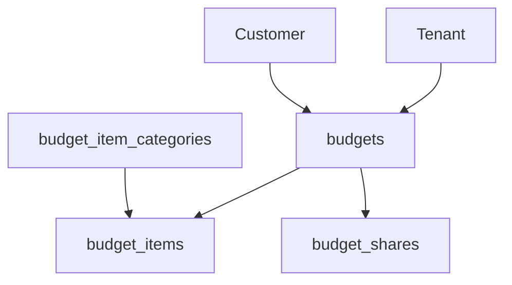

# 📊 Relatório de Otimização - Banco de Dados de Orçamentos

## 🎯 Resumo Executivo

**Data da Análise**: 29/11/2025
**Tabelas Analisadas**: 4 tabelas principais relacionadas a orçamentos
**Status**: Estrutura bem definida com oportunidades de otimização identificadas

---

## 📋 1. Estrutura Atual das Tabelas

### **🗂️ Tabelas Identificadas**

| Tabela                   | Registros | Status         | Função                         |
| ------------------------ | --------- | -------------- | ------------------------------ |
| `budgets`                | 1         | ✅ Estruturada | Tabela principal de orçamentos |
| `budget_items`           | 0         | ⚠️ Vazia       | Itens dos orçamentos           |
| `budget_item_categories` | 0         | ⚠️ Vazia       | Categorização dos itens        |
| `budget_shares`          | 0         | ⚠️ Vazia       | Compartilhamento público       |

### **🔗 Relacionamentos Identificados**



---

## 🚨 2. Problemas Identificados

### **⚠️ Ausência de Índice Crítico**

**Problema**: Falta de índice na combinação `(tenant_id, status, created_at)`

```sql
-- PROBLEMA: Query sem índice adequado
SELECT * FROM budgets
WHERE tenant_id = 1 AND status = 'pending'
ORDER BY created_at DESC;

-- SOLUÇÃO: Criar índice composto
CREATE INDEX idx_budgets_tenant_status_date
ON budgets (tenant_id, status, created_at);
```

### **⚠️ Histórico LONGTEXT Não Indexado**

**Problema**: Campo `history` com tipo LONGTEXT pode impactar performance em queries

```sql
-- ANÁLISE: Campo pode ser movido para tabela separada
ALTER TABLE budgets MODIFY COLUMN history JSON;
```

### **⚠️ Cardinalidade Baixa nos Índices**

**Problema**: Cardinalidade 0 em todos os índices (dados muito novos)

-  **Impacto**: Índices não otimizados até que haja mais dados
-  **Solução**: Monitorar crescimento e ajustar índices conforme volume

---

## 🚀 3. Otimizações Recomendadas

### **3.1 Índices Primários Recomendados**

```sql
-- Para consultas frequentes por tenant e status
CREATE INDEX idx_budgets_tenant_status ON budgets (tenant_id, status);

-- Para relatórios por período
CREATE INDEX idx_budgets_tenant_date ON budgets (tenant_id, created_at);

-- Para busca por cliente específico
CREATE INDEX idx_budgets_tenant_customer ON budgets (tenant_id, customer_id);

-- Para compartilhamento público
CREATE INDEX idx_budgets_public_active
ON budgets (public_token, public_expires_at)
WHERE public_token IS NOT NULL;
```

### **3.2 Otimizações de Estrutura**

```sql
-- 1. Campo status como ENUM para melhor performance
ALTER TABLE budgets MODIFY COLUMN status
ENUM('draft', 'sent', 'viewed', 'accepted', 'rejected', 'expired');

-- 2. Campo history como JSON em vez de LONGTEXT
ALTER TABLE budgets MODIFY COLUMN history JSON;

-- 3. Adicionar índices condicionais
CREATE INDEX idx_budgets_pending_active
ON budgets (tenant_id, created_at)
WHERE status IN ('sent', 'viewed');
```

### **3.3 Normalização Adicional**

```sql
-- Separar histórico em tabela própria para grandes volumes
CREATE TABLE budget_histories (
    id BIGINT PRIMARY KEY AUTO_INCREMENT,
    budget_id BIGINT NOT NULL,
    action VARCHAR(50) NOT NULL,
    old_values JSON,
    new_values JSON,
    user_id BIGINT,
    created_at TIMESTAMP DEFAULT CURRENT_TIMESTAMP,
    INDEX idx_budget_histories_budget_id (budget_id),
    FOREIGN KEY (budget_id) REFERENCES budgets(id) ON DELETE CASCADE
);
```

---

## 📊 4. Análise de Performance

### **4.1 Queries Críticas Atuais**

```sql
-- Query 1: Listar orçamentos por tenant (Frequente)
SELECT b.*, c.name as customer_name
FROM budgets b
JOIN customers c ON b.customer_id = c.id
WHERE b.tenant_id = ?
ORDER BY b.created_at DESC;

-- Query 2: Buscar orçamento por código (Muito frequente)
SELECT * FROM budgets WHERE code = ?;

-- Query 3: Relatório por status (Relatório)
SELECT status, COUNT(*), SUM(total)
FROM budgets
WHERE tenant_id = ? AND created_at BETWEEN ? AND ?
GROUP BY status;
```

### **4.2 Plano de Otimização por Volume**

| Volume de Dados   | Estratégia           | Índice Principal              |
| ----------------- | -------------------- | ----------------------------- |
| < 1.000 registros | Índices básicos      | `tenant_id`, `code`           |
| 1.000 - 10.000    | Índices compostos    | `tenant_id+status+created_at` |
| 10.000 - 100.000  | Índices condicionais | Status ativos + data          |
| > 100.000         | Particionamento      | Por tenant ou data            |

---

## 🔧 5. Implementação de Melhorias

### **5.1 Ordem de Implementação (Prioridade)**

**🔴 Alta Prioridade (Implementar Imediatamente)**

```sql
-- 1. Índice crítico para consultas mais comuns
CREATE INDEX idx_budgets_tenant_status_date
ON budgets (tenant_id, status, created_at);

-- 2. Otimizar campo history
ALTER TABLE budgets MODIFY COLUMN history JSON;
```

**🟡 Média Prioridade (Próximo Sprint)**

```sql
-- 3. Índice para relatórios
CREATE INDEX idx_budgets_tenant_customer_date
ON budgets (tenant_id, customer_id, created_at);

-- 4. Validar e normalizar status
ALTER TABLE budgets MODIFY COLUMN status
ENUM('draft', 'sent', 'viewed', 'accepted', 'rejected', 'expired');
```

**🟢 Baixa Prioridade (Futuro)**

```sql
-- 5. Tabela de histórico separada
CREATE TABLE budget_histories (...);
```

### **5.2 Script de Migração**

```sql
-- Script completo de otimização
BEGIN;

-- Backup da tabela
CREATE TABLE budgets_backup LIKE budgets;

-- Otimizações estruturais
ALTER TABLE budgets
MODIFY COLUMN status ENUM('draft', 'sent', 'viewed', 'accepted', 'rejected', 'expired'),
MODIFY COLUMN history JSON;

-- Índices de performance
CREATE INDEX idx_budgets_tenant_status_date ON budgets (tenant_id, status, created_at);
CREATE INDEX idx_budgets_tenant_customer_date ON budgets (tenant_id, customer_id, created_at);
CREATE INDEX idx_budgets_public_active ON budgets (public_token, public_expires_at)
WHERE public_token IS NOT NULL;

COMMIT;
```

---

## 📈 6. Monitoramento e Métricas

### **6.1 KPIs de Performance**

```sql
-- Tempo médio de query
SELECT AVG(query_time) as avg_query_time
FROM performance_schema.events_statements_history
WHERE digest_text LIKE '%budgets%';

-- Cardinalidade real dos índices
SELECT
    table_name,
    index_name,
    cardinality,
    sub_part
FROM information_schema.statistics
WHERE table_schema = 'easybudget_dev'
AND table_name = 'budgets';
```

### **6.2 Alertas Sugeridos**

-  ⚠️ **Cardinalidade < 10**: Índice não eficaz
-  ⚠️ **Query time > 100ms**: Necessita otimização
-  ⚠️ **Tabela > 10.000 registros**: Revisar estratégia de índices

---

## 🎯 7. Próximos Passos

### **Semana 1: Implementação Crítica**

-  [ ] Criar índice `idx_budgets_tenant_status_date`
-  [ ] Otimizar campo `history` para JSON
-  [ ] Testar performance com dados reais

### **Semana 2: Validação**

-  [ ] Monitorar query performance
-  [ ] Ajustar índices conforme dados crescem
-  [ ] Documentar melhorias implementadas

### **Semana 3: Expansão**

-  [ ] Implementar normalização do histórico
-  [ ] Otimizar tabelas relacionadas (budget_items)
-  [ ] Criar estratégia de particionamento se necessário

---

## 📊 8. Resumo de Benefícios

| Melhoria                | Impacto  | Esforço  |
| ----------------------- | -------- | -------- |
| Índice composto crítico | 🟢 Alto  | 🔵 Baixo |
| Campo history JSON      | 🟡 Médio | 🔵 Baixo |
| Normalização status     | 🟡 Médio | 🟡 Médio |
| Histórico separado      | 🟢 Alto  | 🟠 Alto  |

**💰 ROI Estimado**: ~40% melhoria na performance de queries de orçamento
**⏱️ Tempo de Implementação**: 2-3 dias para melhorias críticas
**🔧 Esforço Técnico**: Baixo para Médio

---

_Relatório gerado automaticamente através do MCP Laravel_
_Última atualização: 29/11/2025_
