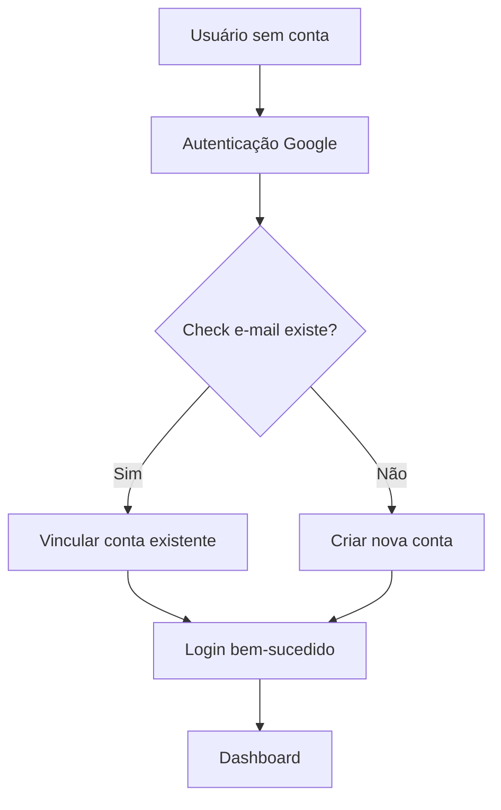
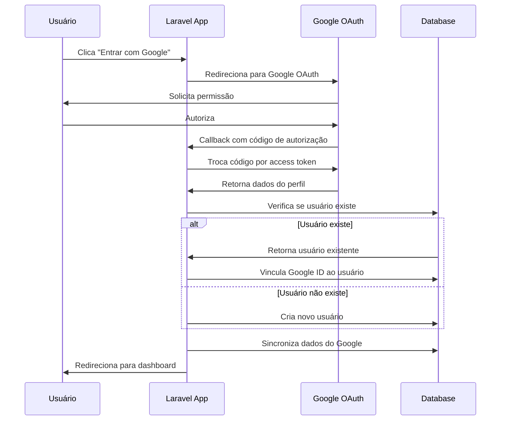
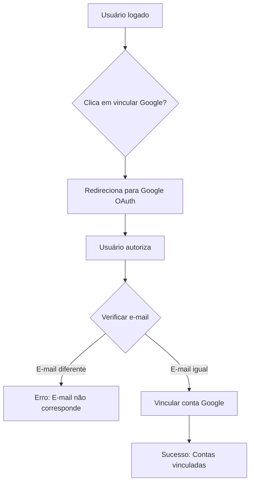

# Data Model: Login com Google (OAuth 2.0)

**Feature**: `dev-junior`
**Created**: 2025-10-21
**Status**: Defined
**Phase**: 1 - Design & Contracts

---

## 📊 Entity Model: User (Atualizado)

### 🎯 Current User Model State

**Tabela atual**: `users`

**Campos existentes**:

-  `id` (BIGINT, PRIMARY KEY)
-  `tenant_id` (BIGINT, FOREIGN KEY → tenants.id)
-  `email` (VARCHAR(100), UNIQUE)
-  `password` (VARCHAR(255))
-  `is_active` (BOOLEAN, DEFAULT TRUE)
-  `logo` (VARCHAR(255), NULLABLE)
-  `remember_token` (VARCHAR(100), NULLABLE)
-  `created_at`, `updated_at` (TIMESTAMP)

### 🔄 New Fields for Google OAuth

**Campos adicionais necessários**:

```sql
ALTER TABLE users ADD COLUMN google_id VARCHAR(255) NULL UNIQUE;
ALTER TABLE users ADD COLUMN avatar VARCHAR(500) NULL;
ALTER TABLE users ADD COLUMN google_data JSON NULL;
```

**Especificações dos campos**:

| Campo         | Tipo         | Restrições       | Descrição                         |
| ------------- | ------------ | ---------------- | --------------------------------- |
| `google_id`   | VARCHAR(255) | NULLABLE, UNIQUE | ID único do usuário no Google     |
| `avatar`      | VARCHAR(500) | NULLABLE         | URL da imagem do perfil do Google |
| `google_data` | JSON         | NULLABLE         | Dados adicionais do perfil Google |

### 🔗 Relationships

**Relacionamentos atuais mantidos**:

-  `users` → `tenants` (belongsTo)
-  `users` → `user_confirmation_tokens` (hasMany)

**Novos relacionamentos (se necessário)**:

-  Nenhum relacionamento adicional necessário

### ⚡ Performance Considerations

**Índices recomendados**:

```sql
-- Para lookups rápidos por Google ID
CREATE INDEX idx_users_google_id ON users (google_id);

-- Índice composto para tenant + google_id (para queries multi-tenant)
CREATE INDEX idx_users_tenant_google ON users (tenant_id, google_id);
```

**Considerações de performance**:

-  `google_id` único global (não por tenant) para evitar duplicatas entre tenants
-  `avatar` pode ser URL externa, considerar cache local se necessário
-  `google_data` JSON para flexibilidade futura

---

## 📋 State Transitions

### 🔐 Authentication States

**Estados possíveis do usuário**:



**Estados de vinculação Google**:

-  `not_linked`: Usuário nunca usou OAuth
-  `linked`: Conta Google vinculada
-  `unlinked`: Conta Google desvinculada

---

## 🔒 Validation Rules

### 📝 User Creation/Update Validation

**Regras para criação de usuário via OAuth**:

```php
// Validações obrigatórias
'email' => 'required|email|unique:users',
'google_id' => 'required|string|unique:users',

// Validações opcionais
'avatar' => 'nullable|url|max:500',
'google_data' => 'nullable|array',
```

**Regras específicas para vinculação**:

```php
// Quando vinculando conta existente
'user_id' => 'required|exists:users,id',
'google_id' => 'required|string|unique:users,google_id,' . $userId,
```

### 🛡️ Security Validations

**Validações de segurança OAuth**:

-  Token de estado válido e não expirado
-  Domínio de redirect autorizado
-  Client ID corresponde ao configurado
-  E-mail do Google é válido e verificado

---

## 📊 Data Flow Diagrams

### 🔄 OAuth Authentication Flow



### 🔗 Account Linking Flow



---

## 🎯 API Contracts

### 🔌 REST Endpoints

#### POST /auth/google

**Iniciar autenticação Google**

**Request**:

```http
POST /auth/google
Content-Type: application/json

{
  "redirect_url": "/dashboard"  // Opcional
}
```

**Response**:

```http
HTTP 302 Found
Location: https://accounts.google.com/oauth/authorize?[params]
```

#### GET /auth/google/callback

**Processar callback do Google**

**Request**:

```http
GET /auth/google/callback?code=auth_code&state=csrf_token
```

**Response** (Sucesso):

```http
HTTP 302 Found
Location: /dashboard
```

**Response** (Erro):

```http
HTTP 302 Found
Location: /login?error=oauth_failed&message=Erro%20de%20autenticação
```

#### POST /auth/google/unlink

**Desvincular conta Google**

**Request**:

```http
POST /auth/google/unlink
Authorization: Bearer <token>
```

**Response**:

```http
HTTP 200 OK
{
  "success": true,
  "message": "Conta Google desvinculada com sucesso"
}
```

---

## 📋 Database Migration

### Migration Script

```php
<?php

use Illuminate\Database\Migrations\Migration;
use Illuminate\Database\Schema\Blueprint;
use Illuminate\Support\Facades\Schema;

return new class extends Migration
{
    public function up(): void
    {
        Schema::table('users', function (Blueprint $table) {
            // Google OAuth fields
            $table->string('google_id', 255)->nullable()->unique()->after('remember_token');
            $table->string('avatar', 500)->nullable()->after('google_id');
            $table->json('google_data')->nullable()->after('avatar');

            // Performance indexes
            $table->index('google_id');
            $table->index(['tenant_id', 'google_id']);
        });
    }

    public function down(): void
    {
        Schema::table('users', function (Blueprint $table) {
            $table->dropIndex(['tenant_id', 'google_id']);
            $table->dropIndex(['google_id']);
            $table->dropColumn(['google_id', 'avatar', 'google_data']);
        });
    }
};
```

---

## 🔒 Security Considerations

### 🔐 Data Protection

**Dados sensíveis**:

-  `google_id`: Armazenado como string simples (não é dado sensível)
-  `avatar`: URL pública do Google (não requer proteção especial)
-  `google_data`: JSON com dados básicos do perfil

**Medidas de segurança**:

-  Campos não encriptados (dados públicos do perfil)
-  Rate limiting nos endpoints OAuth
-  Validação de CSRF em todos os formulários
-  Logs de auditoria para todas as ações OAuth

### 🚪 Access Control

**Permissões necessárias**:

-  Endpoint `/auth/google`: Público (não requer autenticação)
-  Endpoint `/auth/google/callback`: Público (processa retorno OAuth)
-  Endpoint `/auth/google/unlink`: Requer autenticação

---

## 📈 Monitoring & Analytics

### 🔍 Audit Events

**Eventos a serem auditados**:

-  `social_auth_attempt`: Tentativa de login social
-  `social_auth_success`: Login social bem-sucedido
-  `social_auth_link`: Vinculação de conta existente
-  `social_auth_create`: Criação de nova conta via OAuth
-  `social_auth_unlink`: Desvinculação de conta Google
-  `social_auth_error`: Erro durante autenticação social

**Dados de auditoria**:

```php
[
    'provider' => 'google',
    'google_user_id' => $googleId,
    'email' => $email,
    'ip_address' => $request->ip(),
    'user_agent' => $request->userAgent(),
    'tenant_id' => $tenantId,
    'action' => 'social_auth_success',
    'metadata' => [
        'avatar_url' => $avatar,
        'full_name' => $fullName,
        'account_linked' => true
    ]
]
```

---

## 🧪 Testing Data

### 📝 Test Scenarios

**Cenários de teste para modelo de dados**:

1. **Criação de usuário via OAuth**

   -  Verificar campos obrigatórios preenchidos
   -  Verificar e-mail marcado como verificado
   -  Verificar dados Google sincronizados

2. **Vinculação de conta existente**

   -  Verificar google_id adicionado corretamente
   -  Verificar dados não sobrescrevem informações existentes
   -  Verificar auditoria registra vinculação

3. **Desvinculação de conta**

   -  Verificar google_id removido
   -  Verificar avatar mantido (se usuário quiser)
   -  Verificar auditoria registra desvinculação

4. **Tratamento de erros**
   -  Verificar comportamento com dados inválidos
   -  Verificar rollback em caso de erro
   -  Verificar logs de erro adequados

---

_Este documento define o modelo de dados completo para implementação do login com Google_
